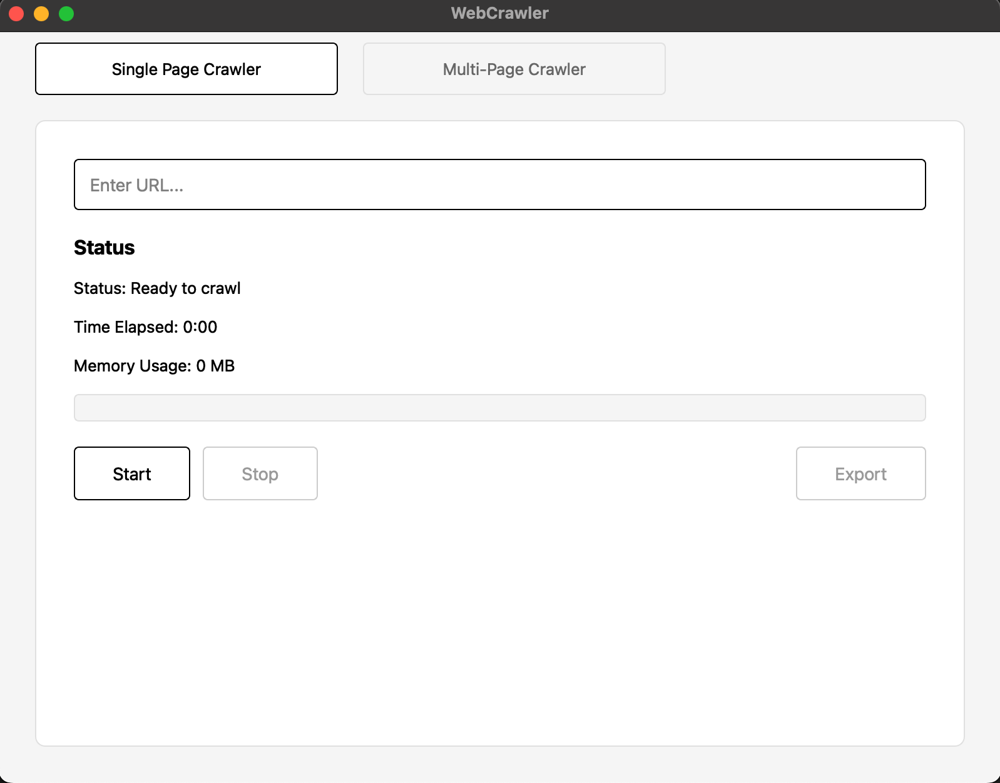
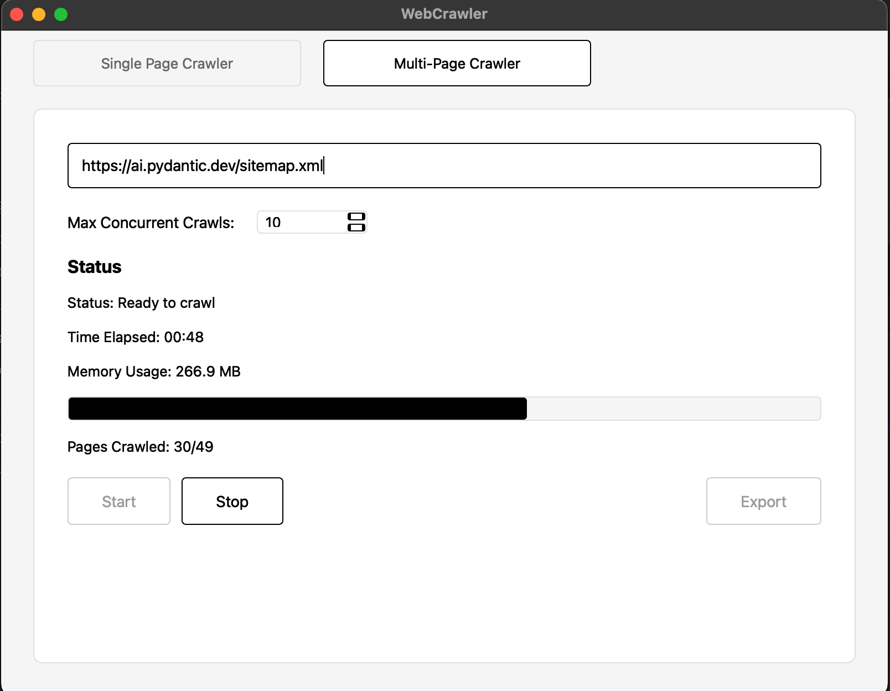
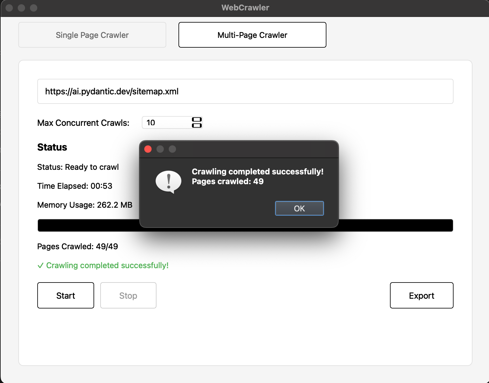

# WebCrawler 🕷️

A desktop application built for effortless web content extraction, specifically designed for RAG (Retrieval-Augmented Generation) implementations with Large Language Models.

## Overview

WebCrawler provides an intuitive graphical interface for extracting clean, well-formatted content from websites. It makes web content extraction accessible to non-technical users while maintaining the quality needed for LLM training and RAG implementations.

## Installation

### Step 1: Download
1. Go to the [Releases](https://github.com/AbithShah/WebCrawler/releases) page
2. Download the latest `WebCrawler_v1.0.zip`
3. Unzip the downloaded file

### Step 2: Install Dependencies
1. Double-click "Install WebCrawler Dependencies.app"
2. Click "OK" when prompted
3. Wait for the installation to complete
4. Click "OK" when installation is finished

### Step 3: Launch Application
1. Double-click WebCrawler.app to launch
2. The application will now be available in your Applications folder

## Features

- 🌐 **Single Page Crawler**: Extract content from individual web pages
- 🕸️ **Multi-Page Crawler**: Process entire websites using sitemap.xml
- 📝 **Clean Text Extraction**: Optimized output for LLM consumption
- 💾 **Export Functionality**: Save extracted content in text format
- 🖥️ **User-Friendly Interface**: No coding knowledge required

## Usage

1. **Single Page Crawling**:

   
   - Enter the URL of the page you want to crawl
   - Click Start
   - Use Export to save the extracted content

2. **Multi-Page Crawling**:
   

   - Enter the website's URL (sitemap.xml will be appended automatically)
   - Click Start
   - Max Concurrent Crwals upto 20

3. **Successful Crawl Example**:

   
   - When crawling completes successfully, the Export button becomes active
   - Click Export to save your extracted content

## Purpose

This tool was developed to streamline the process of gathering web content for RAG implementations. It bridges the gap between web crawling and LLM training by providing clean, structured output suitable for AI model consumption.

## Credits and Acknowledgments

This project builds upon and combines work from:
- [crawl4ai](https://github.com/unclecode/crawl4ai) by unclecode - For the core web crawling functionality
- [coleam00's Pydantic AI Documentation Crawler](https://github.com/coleam00/ottomator-agents/) - For sitemap crawling and documentation extraction features

Built using:
- PyQt6 for the graphical interface
- Playwright for browser automation

Special thanks to:
- The crawl4ai team for their excellent web crawling framework
- Cole Medin (coleam00) for the sitemap crawling implementation

## Author

Created by Abithsha